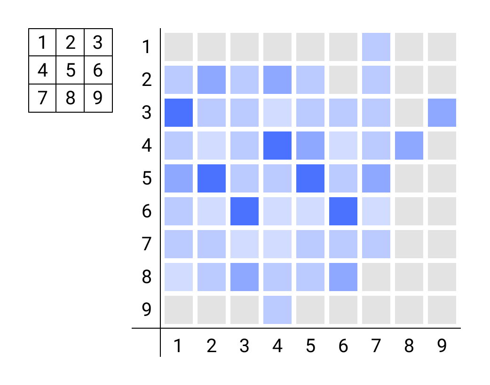

## Instructions

- 모든 과제물은 동료 학습을 통해 학습하고 동료 평가로 평가되어야 합니다.
- 문제에서 별도로 요구하지 않는 이상, Internal CSS나 Inline CSS는 허용하지 않습니다.
- Google, man page, 인터넷 등을 참고하세요.
- html 파일은 [https://validator.w3.org/](https://validator.w3.org/)의 검증을 통과해야합니다.
- css 파일은 [http://jigsaw.w3.org/css-validator/](http://jigsaw.w3.org/css-validator/)의 검증을 통과해야합니다.

- 학습 및 평가를 위해서 `lighttpd` 서버를 사용해야 합니다.
  - MacOS: brew를 설치한 뒤 터미널에서 다음 명령어로 설치할 수 있습니다: `brew install lighttpd`
  - Linux: `apt-get install lighttpd`

## Foreword

## Table of Contents

  
Rush00

  <ol>
    <li><a href="#">필수 구현 사항</a></li>
    <ul>
      <li><a href="#">게임 규칙</a></li>
      <li><a href="#">레이아웃</a></li>
      <li><a href="#">현재 게임 상황</a></li>
      <li><a href="#">누적된 게임 결과</a></li>
    </ul>
    <li><a href="#">보너스 구현 사항</a></li>
  </ol>

# Rush00 - Tic-Tac-Toe

| Rush00                                    |
| ----------------------------------------- |
| 제출 디렉토리 : `ex00/`                   |
| 제출할 파일 : 서브젝트에 관련된 모든 파일 |
| 허용되는 함수 : 해당 없음                 |

하나의 브라우저 창에서 진행될 [틱-택-토](https://en.wikipedia.org/wiki/Tic-tac-toe) 게임을 만드는게 서브젝트의 목적입니다.

## 필수 구현 사항

### 게임 규칙
- 온라인 기능은 없으며, 두 명의 플레이어는 로컬 상황에서 마우스를 번갈아 가면서 클릭하여 게임을 진행합니다.
- 플레이어는 번갈아 가면서 `X`와 `O` 표시를 하고 먼저 한 줄(가로, 세로, 대각선)을 전부 채운 플레이어가 승리합니다.
- `X` 플레이어가 먼저 시작합니다.
- 게임은 3x3 그리드에서 진행됩니다.
- 연속해서 여러 번의 게임을 진행 할 수 있습니다.

### 레이아웃

- `header`: 게임 제목, 메뉴바(필요에 따라)
- `main`: 게임 그리드, 현재 게임 상황
- `aside`: 누적된 게임 결과
- `footer`: 제작자 정보

### 현재 게임 상황

- 현재 게임의 스코어보드를 표시하세요.(ex: `2:1`)
- 어떤 플레이어가 클릭할 차례인지 알 수 있게 현재 턴을 표시하세요.
- 한 줄을 완성하게 되면 시각적으로 피드백을 해야 합니다. 칸에 배경 색을 입히거나, 깜빡이는 등의 표시를 하세요.
- 게임이 종료되면 게임 상황을 표시하세요. (승리, 패배, 무승부)

### 누적된 게임 결과

- 현재까지 몇 번의 게임이 진행 됐는지 표시하세요.
- 인포그래픽: 현재까지 진행된 게임마다 승리한 플레이어, 스코어, 진행된 턴의 횟수 등을 표시하세요.
- 그래프: 현재까지 진행된 모든 게임에서 어떤 칸의 활성도가 높았는지 한 눈에 보이게 칸 별로 이용된 횟수마다 진한 색상을 히트맵으로 표시하세요.

히트맵 참고 이미지. 세로 축은 그리드의 칸, 가로 축은 게임의 턴을 나타냅니다.

요구 사항에 나열된 정보 외에 유의미한 데이터를 표시 할 수 있습니다.

### 그 외

- 사이트 전체 혹은 일부의 레이아웃을 구현하기 위해서는 flex나 grid를 사용해야 합니다. 어느 부분에 어떤 기능을 사용해서 레이아웃을 구현할지 자유롭게 정할 수 있습니다. 단, 사용자 입장에서 사용하기 편한 레이아웃을 구성하세요.
- 플레이어가 클릭할 때마다 `O` 혹은 `X`를 라인 애니메이션으로 표시하세요. 펜을 이용하여 마크를 표시 하는 듯한 애니메이션이 있어야 합니다.
- 처음 접속하면 0.5초간 스플래시 스크린을 띄우세요. 화면 전체를 컬러 블록으로 채우고, 중간 위치에 게임 제목을 텍스트로 표시하세요. 원한다면 이미지를 넣을 수 있습니다.

## 보너스 구현 사항

- `three.js` 라이브러리를 이용해서 게임의 로고 역할을 할 만한 3D 요소를 추가하세요.
- 브라우저의 localStorage에 현재 진행 중이던 게임 정보를 저장하세요.
- 한 턴 마다 시간 제한 기능을 추가하세요. 원하는 시간을 설정할 수 있습니다.
- 모바일 환경을 지원하세요. 터치로 게임을 플레이 할 수 있고 모바일 기기에서 보기 좋은 레이아웃으로 표시 됩니다.
