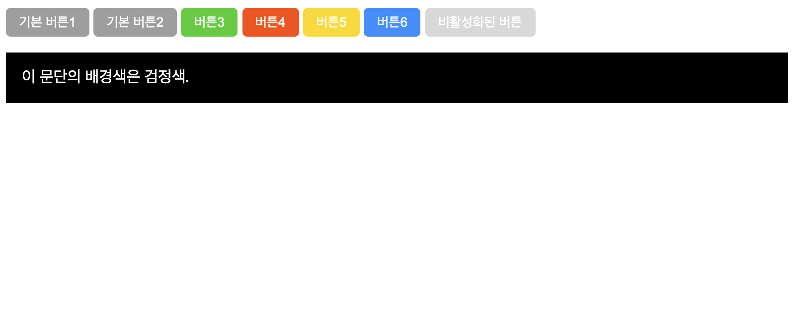

# Exercise 00 - CSS 선택자

| Exercise 00              |
| ------------------------ |
| 제출 디렉토리 : `ex00/`  |
| 제출할 파일 : `ex00.css` |
| 허용되는 함수 : 없음     |

본 서브젝트의 루트 경로에 있는 `appendix/ex00/` 디렉토리를 참고하세요. `ex00.html` 파일에서 불러오고 있는 `ex00.css`를 직접 작성해야 합니다.

- html 파일에는 버튼이 여러 개 있습니다.
- 모든 버튼의...
  - 글자 색상은 `#ffffff`(`white`)입니다.
  - *패딩*은 상하 `1em`, 좌우 `0.5em`입니다.
  - 테두리는 없어야 합니다.
  - 테두리는 `0.35em`의 곡선이 있어야 합니다.
- 기본 버튼의 배경 색상은 `#9e9e9e`입니다.
- 특정 클래스 속성을 가지고 있는 버튼들의 배경 색상은 다음과 같아야 합니다.
  - `success`: `#32cd32`(`limegreen`)
  - `danger`: `#ff4500`(`orangered`)
  - `warning`: `#ffd700`(`gold`)
  - `info`: `#1e90ff`(`dodgerblue`)
- *비활성화된* 버튼은 `0.4`만큼 불투명해야 합니다.
- 아래에 있는 `p` 요소의 배경색은 검정색이어야 합니다.
- html 파일을 수정해서는 안 됩니다.

이 문제에서 *박스 모델*의 모든 내용을 신경 쓸 필요는 없습니다. 보기좋은 레이아웃이 아니더라도 아직은 괜찮습니다.

### 스타일을 적용한 예시 이미지

- 위 이미지는 크롬 브라우저(버전 95.0)에서 캡쳐했습니다.
- 브라우저나 버전마다 약간의 차이가 있을 수 있습니다.
