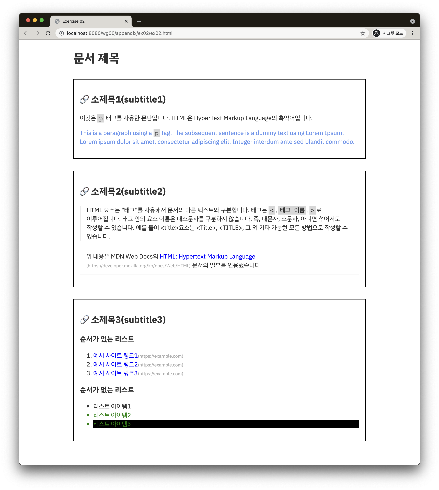

# Exercise 02 - HTML from CSS

| Exercise 02              |
| ------------------------ |
| 제출 디렉토리 : `ex02/`  |
| 제출할 파일 : `ex02.html` |
| 허용되는 함수 : 해당 없음     |

이번에는 `appendix/ex02/` 디렉토리를 참고하세요. `ex02.css`의 내용을 기준으로 HTML을 작성해볼 차례입니다. CSS 군데군데 힌트가 숨겨져 있습니다. 꼼꼼히 살펴보세요.

`ex02.css`에는 다양한 선택자가 있습니다. 이를 참고하여 HTML 파일을 작성해보세요.

- HTML은 [*시맨틱*](https://developer.mozilla.org/ko/docs/Glossary/Semantics)하게 작성 되어야 합니다. 예를 들어 `section`, `article`, `h1`, `h2`, `p` 등이 있습니다.
- 브라우저의 윈도우 상단바 혹은 탭에 표시되는 *제목*은 `Exercise 02`입니다.
- 문서의 모든 소제목은 링크 주소가 `#`로 시작되는 내부 링크가 걸려있습니다.
- 본문의 폰트를 HTML `link` 태그를 사용해서 불러옵니다. [IBM Plex Sans KR
](https://fonts.google.com/specimen/IBM+Plex+Sans+KR?subset=korean)을 사용합니다.
- 폰트는 사용하는 두깨만 불러와야 합니다.
- 내용은 아래 `문서의 내용`의 문자열을 사용하세요.
- `예시 이미지`와 같이 문자열을 적절한 태그로 감싸야 합니다.
- CSS의 *우선 순위*를 고려하세요.
- 당연히 `ex02.html`에서 `ex02.css`를 불러와야 합니다.

### 문서의 내용

```
문서 제목

소제목1(subtitle1)

이것은 p 태그를 사용한 문단입니다. HTML은 HyperText Markup Language의 축약어입니다.

This is a paragraph using a p tag. The subsequent sentence is a dummy text using Lorem Ipsum. Lorem ipsum dolor sit amet, consectetur adipiscing elit. Integer interdum ante sed blandit commodo.

소제목2(subtitle2)

HTML 요소는 "태그"를 사용해서 문서의 다른 텍스트와 구분합니다. 태그는 <, 태그 이름, >로 이루어집니다. 태그 안의 요소 이름은 대소문자를 구분하지 않습니다. 즉, 대문자, 소문자, 아니면 섞어서도 작성할 수 있습니다. 예를 들어 <title>요소는 <Title>, <TITLE>, 그 외 기타 가능한 모든 방법으로 작성할 수 있습니다.

위 내용은 MDN Web Docs의 HTML: Hypertext Markup Language 문서의 일부를 인용했습니다.

소제목3(subtitle3)

순서가 있는 리스트

예시 사이트 링크1
예시 사이트 링크2
예시 사이트 링크3

순서가 없는 리스트

리스트 아이템1
리스트 아이템2
리스트 아이템3
```

### 스타일을 적용한 HTML 문서 예시 이미지



- 위 이미지는 크롬 브라우저(버전 95.0)에서 캡쳐했습니다.
- 브라우저나 버전마다 약간의 차이가 있을 수 있습니다.
