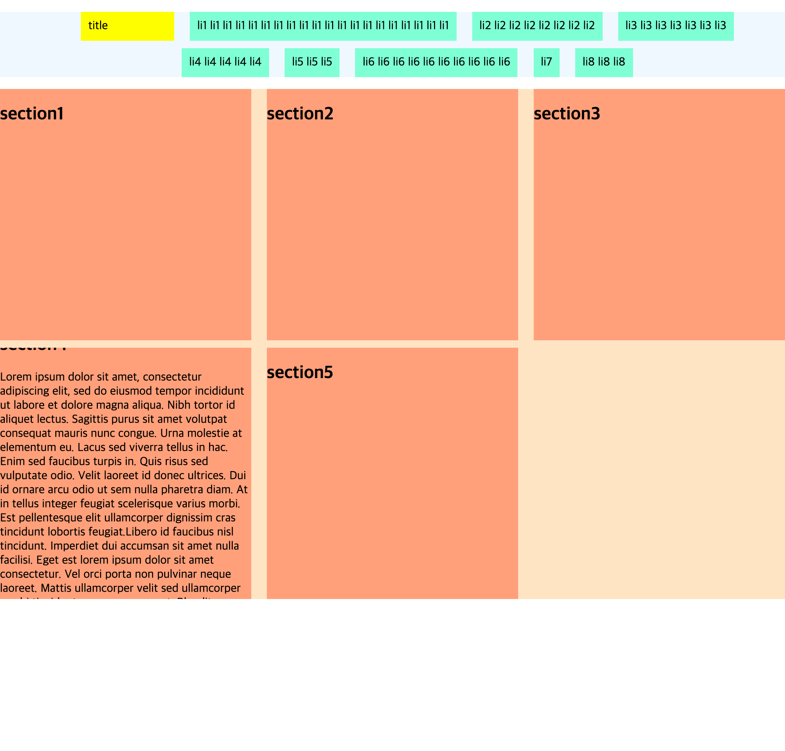

# Exercise 04 - basic layout

| Exercise 04              |
| ------------------------ |
| 제출 디렉토리 : `ex04/`  |
| 제출할 파일 : `ex04.html`, `ex04.css` |
| 허용되는 함수 : 해당 없음     |

두 개의 flex 레이아웃을 만들어 봅시다.

- `body`는 `nav`, `main` 요소를 가지고 있습니다.
- `body`의 마진과 패진 값은 `0`입니다.
- 구분이 잘 되도록, flex container와 flex item에 다른 배경 색상을 설정하세요.
- 각 flex container에 들어갈 flex item은 최소 3개 부터 최대 50개까지 테스트됩니다.
- 모든 flex item은 브라우저 가로 폭을 줄이더라도 화면 안에 표시되어야 합니다.

## `nav`
- 이 요소 아래에는 *순서가 없는 리스트*와 그 리스트의 아이템이 들어갑니다.
- 리스트에는 최소 3개 이상의 아이템이 추가될 수 있습니다.
- 리스트는 flex container, 아이템은 flex item이 됩니다. 알아보기 편하게 각각 다른 배경 색상을 자유롭게 설정하세요.
- 메뉴 아이템은 가로 방향 순서로 표시되고 중앙 정렬 됩니다.
- 메뉴 아이템 간의 간격은 세로 `10px` 가로 `2vw`입니다.
- 리스트를 표시하는 점 등의 스타일이 표시되면 안 됩니다.
- 리스트의 아이템 중 하나는 `title` 클래스를 가지고 있으며, HTML 상 리스트 안의 **어느 순서에 위치하더라도** 화면에서는 제일 첫 번째에 표시되어야 합니다.
- `title` 클래스를 가진 아이템은 다른 아이템과는 다른 배경 색상을 설정하세요.
- 제목과 메뉴의 내용은 자유롭게 설정하세요. 어느 길이의 텍스트가 들어가더라도 적절한 크기로 표시되어야 합니다.

## `main`
- `main`에는 여러 개의 `section`가 들어갑니다.
- `section`은 `h2`와 `p` 요소를 가지고 있습니다.
- `section` 안의 텍스트가 길어지더라도 가로 길이와 세로 길이는 `32vw`로 고정되어야 합니다.
- 길이가 `section`을 넘어가는 텍스트는 스크롤해서 확인할 수 있습니다.
- `section`들은 가로 방향 순서로 표시되고 우측 정렬 됩니다.
- `section` 간의 간격은 세로 `10px` 가로 `2vw`입니다.

### 예시 이미지

이미지 안의 네 번째 section은 스크롤 되었습니다. 
