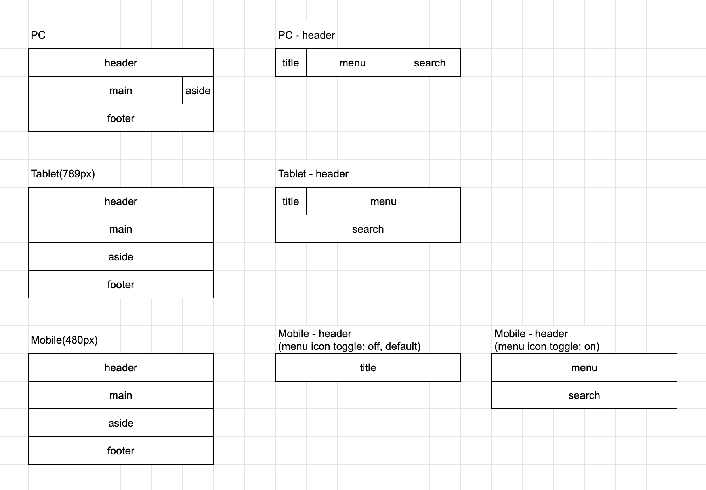
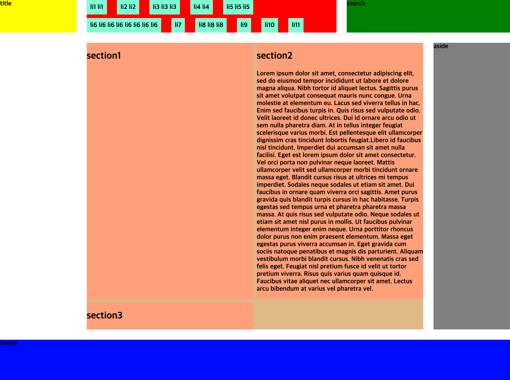
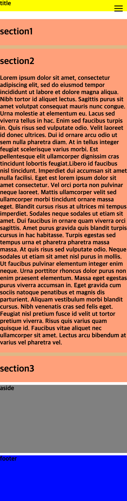

# Exercise 05 - 

| Exercise 05              |
| ------------------------ |
| 제출 디렉토리 : `ex05/`  |
| 제출할 파일 : `ex05.html`, `ex05.css` |
| 허용되는 함수 : 해당 없음     |

앞에서 만든 레이아웃은 브라우저의 가로 길이가 충분히 넓은 상황에서는 잘 보이지만 창 크기가 줄어준다면 보기 힘들어집니다.
그리드를 사용해서 반응형 레이아웃을 만들어 봅시다. 이미지와 설명을 참고해서 만들어보세요.

## 공통 내용

- 레이아웃의 큰 틀은 다음과 같이 나눠집니다: `header`, `main`, `aside`, `footer`
- `header`는 `title`, `menu`, `search`로 구성되어있습니다.
- `main`은 여러 개의 `section`으로 구성 됩니다.
- `section`은 패딩 값은 `1em`입니다.
- 그리드 컬럼은 6개입니다.
- 반응형 환경에 따라 조금씩 다른 그리드를 구현해야 합니다.
- 각 구역마다 구분이 잘 되도록 다른 배경 색상을 설정하세요.
- 각 구역마다 적절한 *최소 높이* 값이 있어야 합니다.

## 반응형 환경별 내용

### PC(790px 이상)
- menu 목록은 가로 방향입니다.
- `main` 안의 `section`은 2단의 flex로 구현됩니다.
- `main`의 오른쪽은 aside, 왼쪽은 비어있는 공간입니다.

### Tablet(789px 이하)
- menu 목록은 가로 방향입니다.
- `main` 안의 `section`은 2단의 flex로 구현됩니다.

### Mobile(480px 이하)
- `appendix/ex05`에 있는 `menu_icon.svg`를 사용하여 오른쪽 상단에 메뉴 아이콘을 만들어야 합니다.
- 메뉴 아이콘은 항상 같은 자리에 *픽스*되어 있습니다.
- 메뉴 아이콘을 클릭하면 header 안의 menu와 search 부분이 토글 됩니다. 아래 이미지를 참고하세요.
- 토글을 위한 스크립트는 `body` 요소의 맨 마지막에 `script` 태그로 추가됩니다.
- menu 목록은 세로 방향입니다.
- `main` 안의 section은 1단의 flex로 구현됩니다.

### 레이아웃 참고 이미지

### 예시 이미지

## PC

## Tablet

## Mobile

