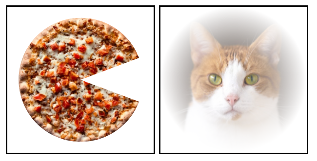

# Exercise 03 - Clipping and Masking

| Exercise 03                                                        |
| ------------------------------------------------------------------ |
| 제출 디렉토리 : `ex03/`                                            |
| 제출할 파일 : `ex03.html`, `ex03_clipping.jpg`, `ex03_masking.jpg` |
| 허용되는 모듈 : 해당 없음                                          |

본 서브젝트의 루트 경로에 있는 `appendix/ex03/` 디렉토리를 참고하세요. `ex03.html` 파일의 `body` 내부에 모든 코드를 작성해야 합니다.

한 조각 먹은 피자와 아련한 고양이 사진을 만들어 봅시다.

- 각 svg 캔버스의 크기는 `200x200px`이어야 합니다.
- `body` 태그 이외에 다른 코드를 수정해서는 안 됩니다.
- 이미지는 캔버스에 꽉 차게 설정해야 합니다.

## 한 조각 먹은 피자

- `appendix/ex03/` 디렉토리 내부의 `ex03_clipping.jpg` 이미지를 사용하세요.
- 팩맨 모향 패스를 만들고 이미지를 클리핑해봅시다.

## 아련한 고양이

- `appendix/ex03/` 디렉토리 내부의 `ex03_masking.jpg` 이미지를 사용하세요.
- 고양이를 아련하게 만들 원형 그라디언트를 만드세요.
- 이미지의 크기와 같은 정사각형을 만들고 앞서 만든 그라디언트로 채워보세요.
- 정사각형으로 이미지를 마스킹해봅시다.

예시 이미지와 완벽히 같지 않아도 됩니다. 단, 평가자가 충분히 납득할 수 있을 결과물이 필요합니다.
