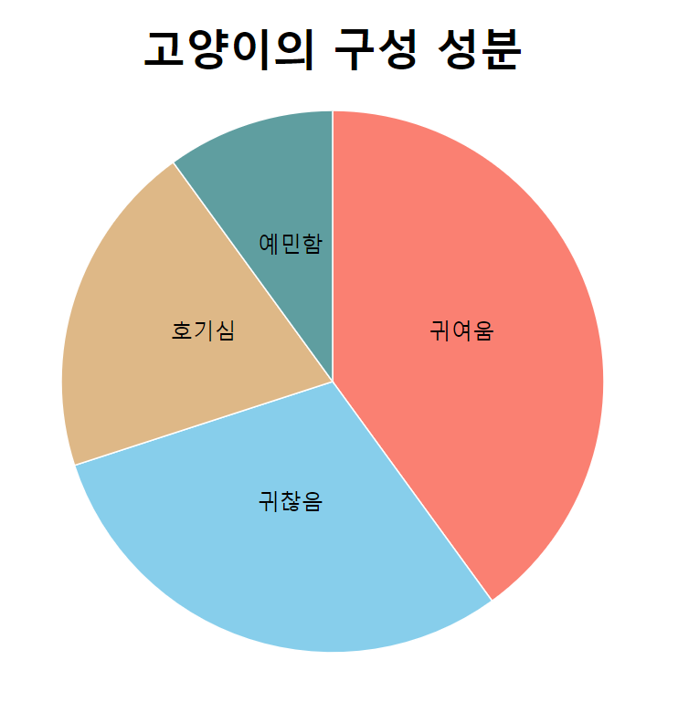

# Exercise 02 - Bar Chart

| Exercise 02             |
| ----------------------- |
| 제출 디렉토리 : `ex02/` |
| 제출할 파일 : `ex02.js` |
| 허용되는 모듈 : D3.js   |

본 서브젝트의 루트 경로에 있는 `appendix/ex02/` 디렉토리를 참고하세요. `ex02.html` 파일에서 불러오고 있는 `ex02.js`를 직접 작성해야 합니다.

고양이의 구성 성분을 보여주는 막대 그래프를 만들어봅시다.

- 그래프에 사용될 데이터는 다음과 같습니다.

```js
const data = [
  { label: '귀여움', value: 4 },
  { label: '귀찮음', value: 3 },
  { label: '호기심', value: 2 },
  { label: '예민함', value: 1 },
];
```

- 그래프의 막대는 수평으로 표시되어야 합니다.
- 막대의 가로 길이는 `value`의 최댓값이 svg 캔버스의 가로 길이가 되도록 스케일링하세요.
- 각 막대 사이에는 공간이 있어야 합니다.
- 각 막대의 색상은 `color` 값을 사용하여 나타내야 합니다.
- 제목(`고양이의 구성 성분`)과 레이블이 표시되어야 합니다.
- x축에는 `value`, y축에는 `label`이 표시되어야 합니다.
- 차트의 모든 요소는 D3.js의 메소드를 사용하여 나타내야 합니다.
- 차트의 어떤 요소도 잘리지 않고 svg 캔버스 안에 출력되어야 합니다.
- html 파일을 수정해서는 안 됩니다.
- 완성된 차트의 예시 이미지는 아래와 같습니다.
  
