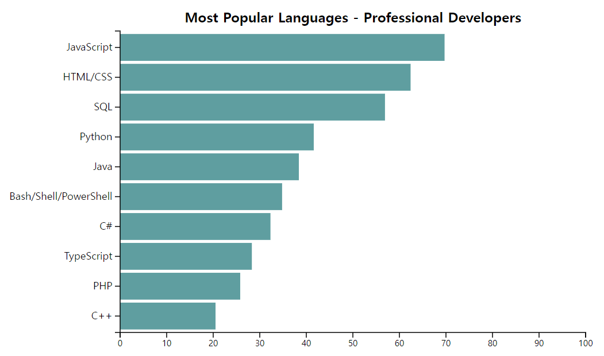

# Exercise 03 - Bar Chart

| Exercise 03             |
| ----------------------- |
| 제출 디렉토리 : `ex03/` |
| 제출할 파일 : `ex03.js` |
| 허용되는 모듈 : D3.js   |

본 서브젝트의 루트 경로에 있는 `appendix/ex03/` 디렉토리를 참고하세요. `ex03.html` 파일에서 불러오고 있는 `ex03.js`를 직접 작성해야 합니다.

2020년 가장 인기있는 개발 언어를 보여주는 막대 그래프를 만들어봅시다.

- 그래프에 사용될 데이터는 `appendix/ex03/` 디렉토리의 `data.json`입니다.
  - 출처: https://insights.stackoverflow.com/survey/2020
- 그래프의 막대는 수평으로 표시되어야 합니다.
- 막대는 `percentage`의 값을 기준으로 내림차순 정렬되어야 합니다.
- 막대의 가로 길이는 `percentage`의 최댓값이 svg 캔버스의 필요한 여백을 제외한 가로 길이가 되도록 스케일링하세요.
- 각 막대 사이에는 여백이 있어야 합니다.
- 막대의 색상은 기본 색상이 아니어야 합니다.
- 제목(`Most Popular Languages - Professional Developers`)과 레이블이 표시되어야 합니다.
- x축에는 `percentage`, y축에는 `language`가 표시되어야 합니다.
  - x축 도메인의 최솟값은 `0`, 최댓값은 `100`입니다.
- 축이 막대 뒤로 가려지면 안 됩니다.
- 차트의 모든 요소는 D3.js의 메소드를 사용하여 나타내야 합니다.
- 차트의 어떤 요소도 잘리지 않고 svg 캔버스 안에 출력되어야 합니다.
- html 파일을 수정해서는 안 됩니다.
- 완성된 차트의 예시 이미지는 아래와 같습니다.
  
