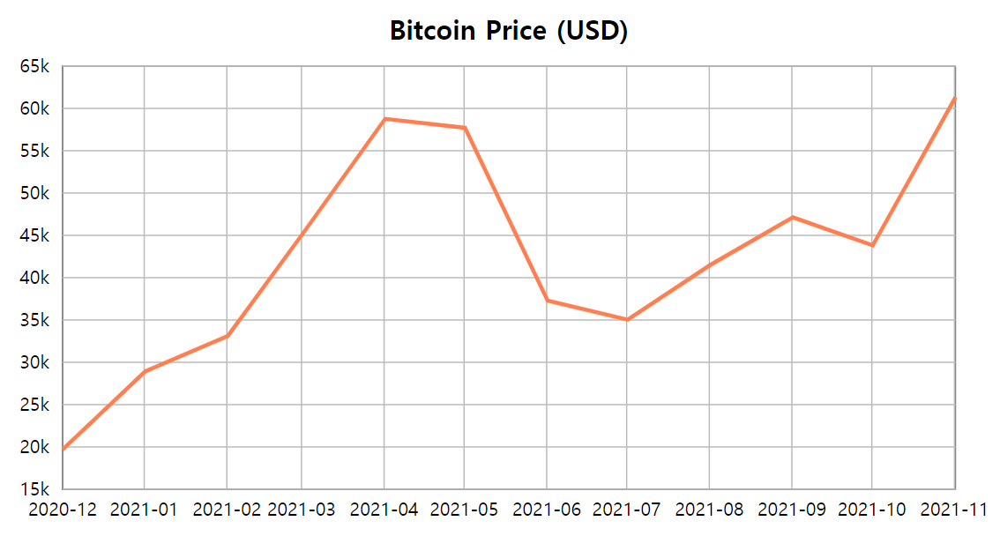

# Exercise 04 - Line Chart

| Exercise 04             |
| ----------------------- |
| 제출 디렉토리 : `ex04/` |
| 제출할 파일 : `ex04.js` |
| 허용되는 모듈 : D3.js   |

본 서브젝트의 루트 경로에 있는 `appendix/ex04/` 디렉토리를 참고하세요. `ex04.html` 파일에서 불러오고 있는 `ex04.js`를 직접 작성해야 합니다.

2020년 12월부터 2021년 11월까지 1년 간의 비트코인 가격을 보여주는 선 그래프를 만들어봅시다.

- 그래프에 사용될 데이터는 `appendix/ex04/` 디렉토리의 `data.csv`입니다.
  - 출처: https://kr.investing.com/crypto/bitcoin/historical-data
- 제목(`Bitcoin Price (USD)`)과 레이블이 표시되어야 합니다.
- x축에는 `timestamp`, y축에는 `price`가 표시되어야 합니다.
  - `timestamp`는 `YYYY-MM` 형식으로 표기해야 합니다.
  - `price`는 1000이 넘는 경우 1K와 같은 형식으로 표기해야 합니다.
- 각 축의 틱 크기를 조정하여 격자 무늬가 되도록 하세요.
- 차트의 모든 요소는 D3.js의 메소드를 사용하여 나타내야 합니다.
- 차트의 어떤 요소도 잘리지 않고 svg 캔버스 안에 출력되어야 합니다.
- html 파일을 수정해서는 안 됩니다.
- 완성된 차트의 예시 이미지는 아래와 같습니다.
  
